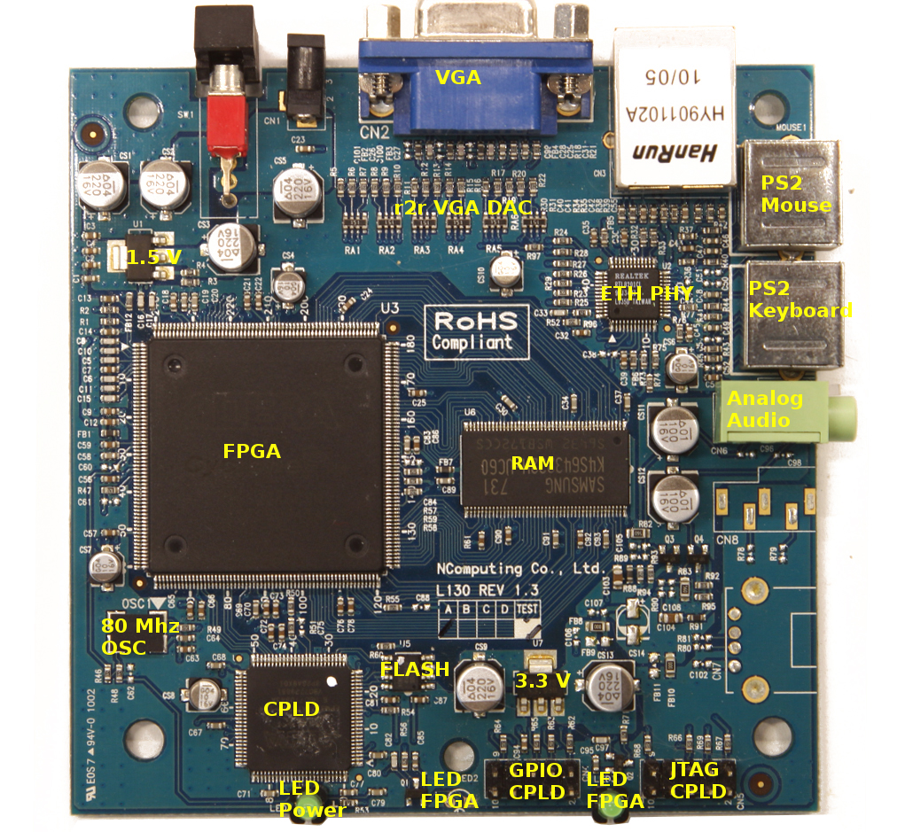
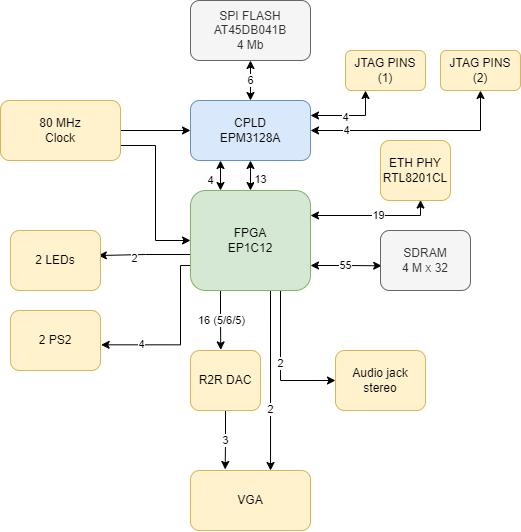

# Ncomputing-l130
Ncomputing L130 PCB reverse engineering

The idea of this project is to reverse engineering the Ncomputing L130 PCB (rev 1.3A).

The goal is to be able to use it as a generic FPGA development board. Ideally we would like to reprogram both the FPGA and the CPLD so that we can program any bitstream permanently using the flash memory.

# Photo of the board

# Board without main components

Both images were distorted so that the vias match. The top image is the top layer and the bottom image is the bottom layer.

# Component list

[You can find the full component list here. Some of them might not have values, or may contain errors.](docs/components.csv)

# Block diagram

# Requirements
- Ncomputing L130 board
- JTAG programmer: Altera USB Blaster
- Software: Quartus II 13.0sp1 (can be downloaded from Intel website, has Linux support)

# Building the projects and programming the board

- cpld-passthrough: This project is used to program the CPLD. It makes the CPLD passthrough the signals required for programming the FPGA.
- fpga-blink: This project is used to program the FPGA. It makes the FPGA blink the LEDs.

**When using Quartus to generate the bitstream, remember that by default non defined pins are marked as outputs and are LOW. This can cause short circuits and destroy the rest of the circuit. To avoid that, you should go to Assignments->Device->Device and Pin Options...->Unused Pins and set it to "As input tri-stated with weak pull-up".**

When using the Altera USB Blaster, you need to bridge the pins 5 and 7 of the GPIO CPLD connector (see the picture above) with a 1kΩ resistor. This basically ensures that the nStatus signal follows the nConfig one, and that makes the programmer think that the FPGA is ready to be programmed. Somehow this signal is not routed, thus we need this small hack. You can use a small SMD resistor for this. 

# Documentation

The [docs](docs/) folder contains many documents that are useful for this project.

# Goals

- ✅ Reverse engineer main components and connections
- ✅ Basic Blinky test for CPLD
- ✅ Using Passive Serial Configuration for loading FPGA bitstream (CPLD passes through programming signals to FPGA)
- ❌ CPLD code to load FPGA bitstream from serial flash
- ✅ Blinky in FPGA
- ❌ Serial port FPGA
- ❌ Sound output
- ❌ Keyboard input
- ❌ VGA output
- ❌ Retrocomputing
- ❌ Mouse input
- ❌ External SDRAM
- ❌ Ethernet: raw tx and rx
- ❌ Ethernet: udp tx and rx
- ❌ Reverse engineer full board

# Thanks to
[Carlos Pantelides (cpantel)](https://github.com/cpantel/)

# Inspirations
- https://github.com/UzixLS/ncomputing-l230
