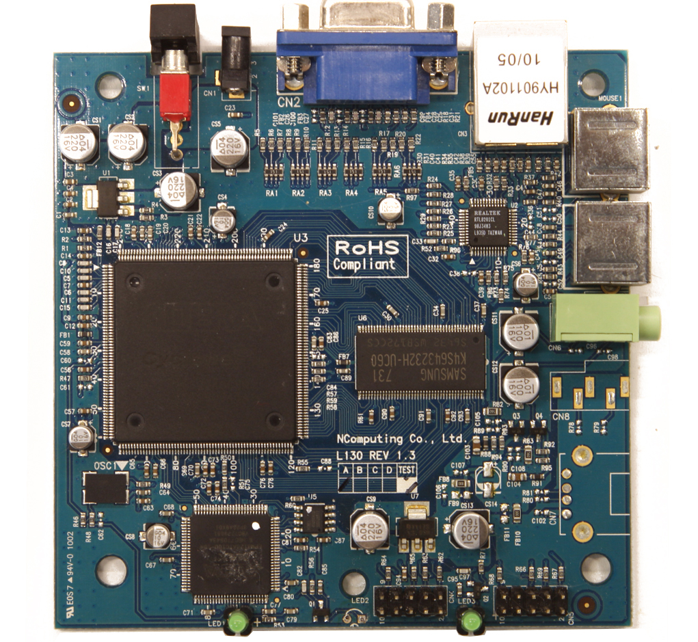

# Ncomputing-l130
Ncomputing L130 PCB reverse engineering

The idea of this project is to reverse engineering the Ncomputing L130 PCB (rev 1.3A).

The goal is to be able to use it as a generic FPGA development board. Ideally we would like to reprogram both the FPGA and the CPLD so that we can program any bitstream permanently using the flash memory.

# Photo of the board

# Block diagram

# Requirements
- Ncomputing L130 board
- JTAG programmer: Altera USB Blaster
- Software: Quartus II 13.0sp1 (can be downloaded from Intel website, has Linux support)

We'll try to reprogram the board without requiring any physical mods. If we can't, we'll try to modify it as little as possible.

# Objectives

- Reverse engineer main components and connections
- Basic Blinky test for CPLD
- Using ASP for loading FPGA bistream
- CPLD code to load FPGA bitstream from serial flash
- Blinky in FPGA
- Serial port FPGA
- Sound output
- Keyboard 
- VGA output
- Retrocomputing
- Mouse
- External SDRAM
- Ethernet: raw tx and rx
- Ethernet: udp tx and rx
- Reverse engineer full board

# Inspirations
- https://github.com/UzixLS/ncomputing-l230