# Requirements
- Ncomputing L130 board
- JTAG programmer: Altera USB Blaster
- Software: Quartus II 13.0sp1 (can be downloaded from Intel website, has Linux support)

You need to bridge the pins 5 and 7 of the GPIO CPLD connector (see the picture above) with a 1kΩ resistor. This basically ensures that the nStatus signal follows the nConfig one, and that makes the programmer think that the FPGA is ready to be programmed. You can use a small SMD resistor for this.

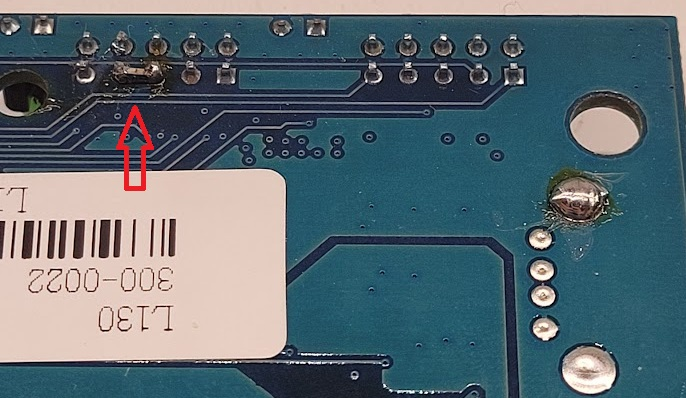

# Building CPLD project

Create a new project in Quartus, pointing to the `cpld_passthrough` folder in the repository. Use that same name for the project name and top-level design:

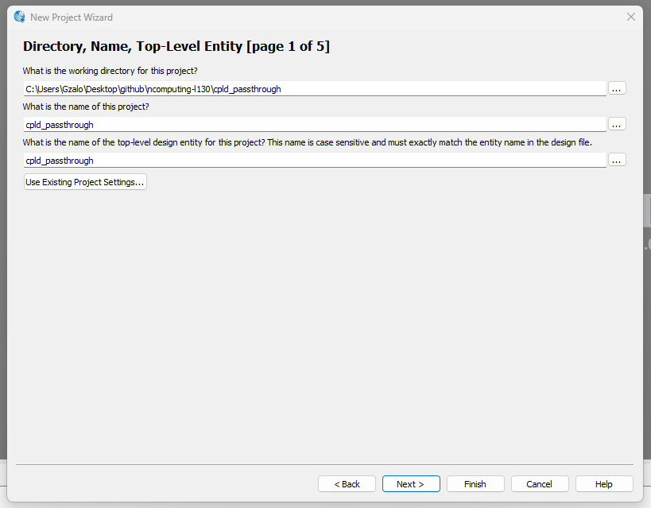

Go to the next step and press `add all`. You should see all three files.

Go to the next step and select the appropiate device: EPM3128ATC100-10 from the MAX3000A family

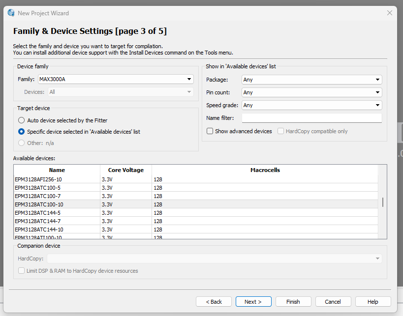

Press `Finish`. Then go to Assignments->Device->Device and Pin Options...->Unused Pins and set it to "As input tri-stated":

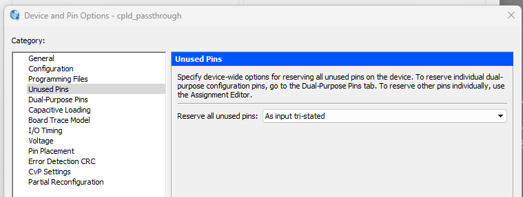

Go to Processing->Start compilation. After a few seconds it should succeed. There may be some warnings (shown as red in the `TimeQuest Timing Analyzer`), they can be ignored.

Go to Assignments->Pin Planner and you should see the following assignments:

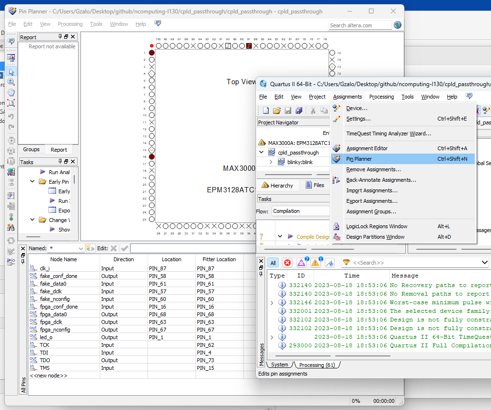

# Programming CPLD

Connect the cable to the connector on the right, keeping in mind the position of pin 1 (red mark of the cable). Then connect the programmer to a computer, connect and power on the board. 

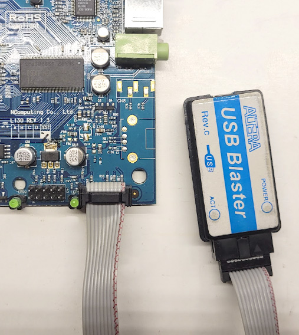

Go to Tools->Programmer, press Hardware Setup and select the USB-Blaster hardware. 

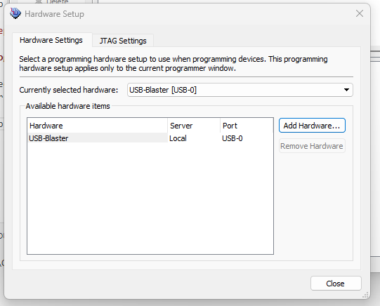

Check the "Program/Configure" checkbox and then press Start

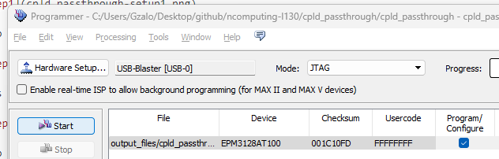

If everything went ok, it should show a success message:

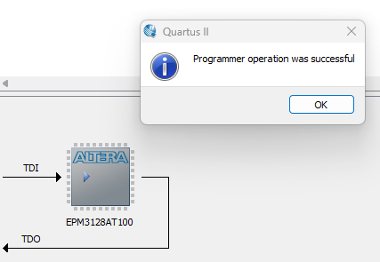

# Building FPGA project

Create a new project in Quartus, pointing to the `fpga_blink` folder in the repository. Use that same name for the project name and top-level design:

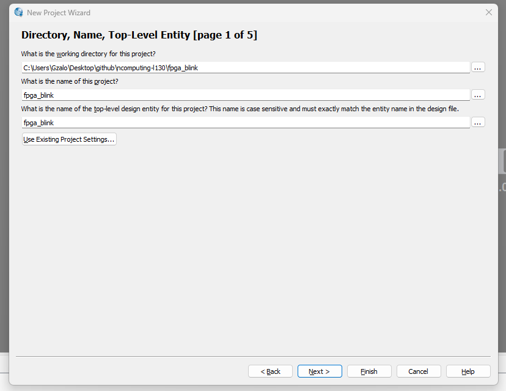

Go to the next step and press `add all`. You should see all three files.

Go to the next step and select the appropiate device: EP1C6Q240C8 from the Cyclone family

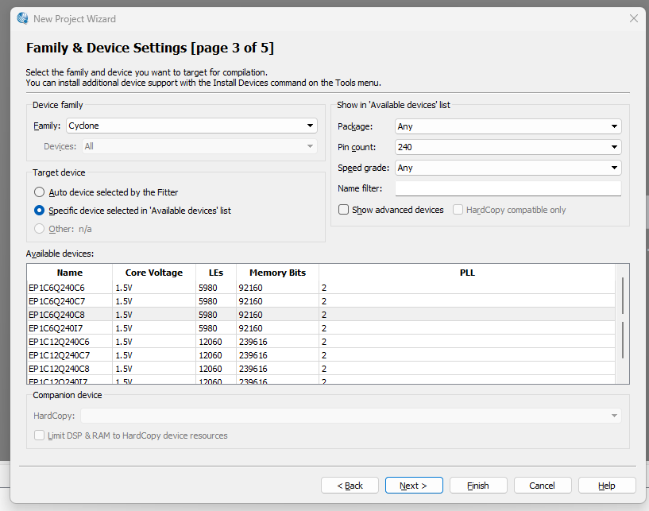

Press `Finish`. Then go to Assignments->Device->Device and Pin Options...->Unused Pins and set it to "As input tri-stated with weak pull up":

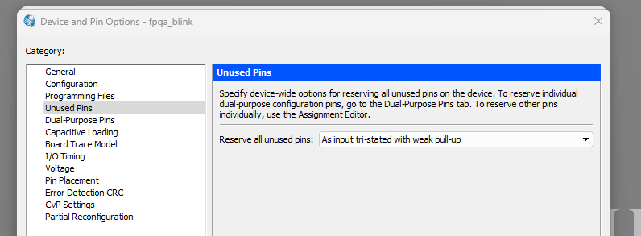

Go to Processing->Start compilation. After a few seconds it should succeed. There may be some warnings (shown as red in the `TimeQuest Timing Analyzer`), they can be ignored.

Go to Assignments->Pin Planner and you should see the following assignments:

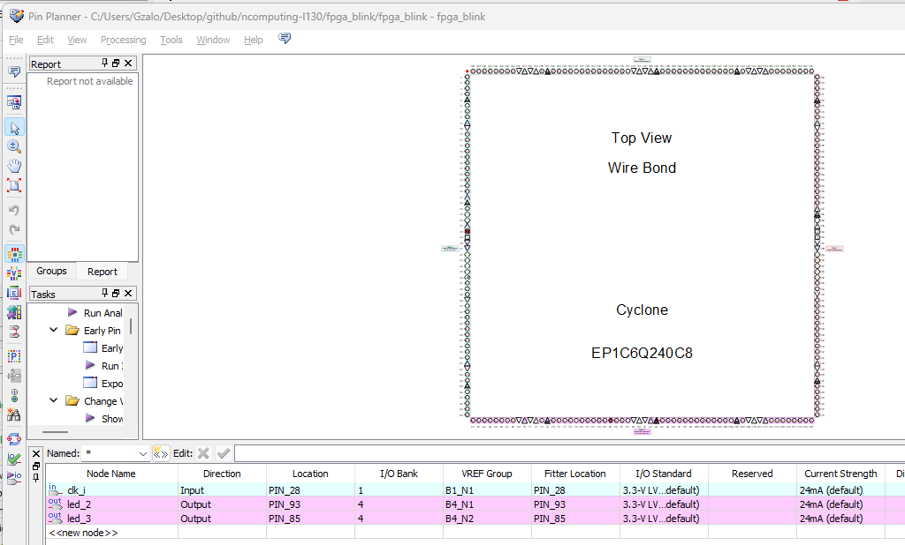

# Programming FPGA

Connect the cable to the connector on the middle, keeping in mind the position of pin 1 (red mark of the cable). Then connect the programmer to a computer, connect and power on the board. 

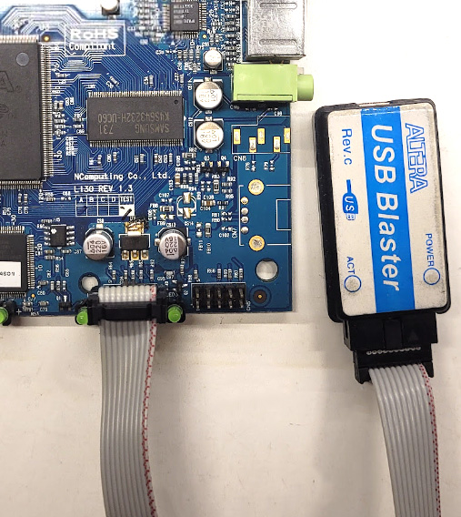

Go to Tools->Programmer, press Hardware Setup and select the USB-Blaster hardware. 

Select "Passive Serial" as mode (on the top right) and then press Start

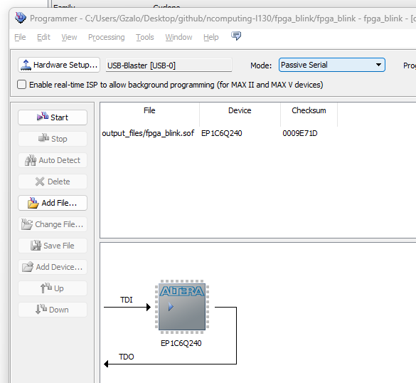

If everything went ok, it should show a success message, and you should see the blinking LEDs in the board!
