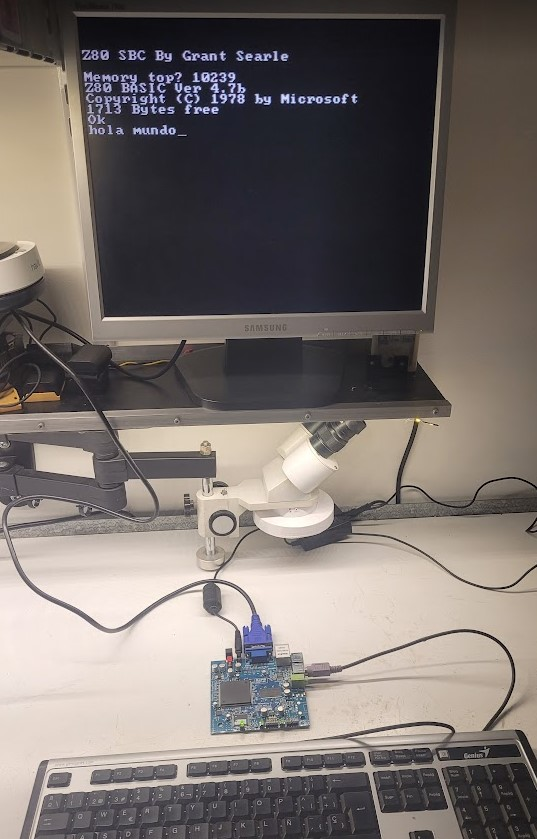

# Multicomp

[Multicomp is a guide made by Grant Searle](http://searle.x10host.com/Multicomp/index.html) which can be used to create a retrocomputing environment using an FPGA. 
There are a few things that need to be considered when following his guide. I've only tried Z80 with BASIC ROM, and soon I'll likely upload a ready to use version of his code that works with our board.

## Memory
The FPGA he uses has more internal memory (13 KB total vs 10.2 KB in ours) so there are a few things that don't really fit. We need at least:

- 8 KiB for the Z80 BASIC ROM (0x0000-0x2000)
- 1 KiB for the reduced character ROM (128*8 bytes)
- 2 KB for the character video memory (40x25x2 bytes)
- 2 KiB for system RAM that can be used in BASIC (0x2000-0x27FF)

As it can be seen, to fit that minimal system we would need a bigger FPGA, as it sums up to 13 KB. But we can do a trick and split the Z80 ROM into two. First 5120 bytes can be implemented using the internal memory, and the rest of the ROM can be implemented as logic elements. This increases the logic usage a lot (and it takes a lot more time to synthesize too) and it almost doesn't fit, but it works just fine. I had to create a simple program to do this split as it's not supported natively.

Unfortunately our board doesn't have readily available pins for connecting an external static RAM. We could use the external DRAM but it will need an additional controller to use it as a SRAM, still haven't had much time to look into that.

## Cyclone model
Some of his autogenerated VHD files (mostly the ones related to memories) are suited to a Cyclone II board, so they need to change or they won't even compile. Running the IP wizard on those and generating them again should work fine.

## Clock
His design expects the clock to be a 50 MHz signal, so there are a few things that won't work directly unless we change that. The easiest way is to include a PLL that turns the external 80 MHz into the expected one.

## Pins for serial UART
Since we have unused pins, it is possible to connect them to an external UART to use it instead of a keyboard. Since they aren't wired in the board it may be a bit harder to connect to them directly as the FPGA has pins with a 0.5mm pitch. It may be possible to use a modded SMD adapter to do so, lifting the unused pins and soldering them in a board, then fixing that board with resin for mecanical strength (pending investigation).